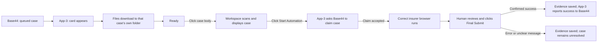

# 📬 How a Base44 case travels through App-3

**Plain-language guide to the current application — reviewed from the App-3 source on 26 September 2026.** This describes what the software does today. It does not change the application or confirm the current state of any live Base44 case.

> **The main idea:** Base44 supplies a case. App-3 downloads a local copy. Clicking the case opens it for review. **Starting insurer automation is a separate action.** The insurer's **Final Submit** is still a human action.

## 🗺️ The whole journey



**Example:** Base44 sends case **#051, JDB/.../7666, PB79A9396, New India**. App-3 downloads it under the **New India** folder. Clicking the card opens its documents in Workspace. Nothing is claimed just because you clicked the card. Only **Start Automation** asks Base44 for permission to begin the insurer work.

## 1. 📥 How the case arrives

App-3 signs in to DocWriter with the locally saved operator login. It asks Base44 for queued jobs approximately **every 30 seconds**. This is polling: Base44 does not need to open or control the App-3 window.

| Item Base44 provides       | What it means to the operator                                                                                                                  |
| -------------------------- | ---------------------------------------------------------------------------------------------------------------------------------------------- |
| `case_id`                | The permanent internal identity. App-3 uses this to keep cases separate.                                                                       |
| `automation_dispatch_id` | Identity of this particular**Send to App-3** action. If the same case is sent again, a new dispatch can be treated as new incoming work. |
| `case_ref`               | Readable case reference on the card, such as`JDB/2026-27/PORTAL/7666`.                                                                       |
| `vehicle_no`             | Vehicle number shown on the card and used in the local folder name.                                                                            |
| `insurer`                | Insurer name, used to find the right portal if`portal_id` is not supplied.                                                                   |
| `portal_id`              | Optional explicit portal choice.**If supplied, it takes priority** over the insurer text.                                                |
| `surveyor_profile_id`    | Identifies whose portal login should be selected.                                                                                              |
| `status`                 | Base44's own case status, usually`queued_for_automation` when it reaches this inbox.                                                         |
| Drive file information     | Lets App-3 request the case files and the flagged latest corrected Excel.                                                                      |

The `#051` number is only an App-3 display number. It is **not** the Base44 case ID or dispatch ID. It remains stable in local state after a restart. A job missing a readable ID needed for staging can appear as **Needs Attention**; an item with no usable `case_id` cannot be identified and is skipped. The current queue request asks for at most **25** jobs; if Base44 has more and provides no pagination, App-3 warns that some may not be visible.

## 2. 📦 What happens during download

While connected, App-3 tries to stage incoming cases automatically, up to **two cases at a time**. “Stage” means **download and verify a local working copy**. It does **not** mean starting the insurer browser or claiming the case. Other cases can continue downloading while one case is active.

The normal download choice is one verified ZIP. If that cannot be used for an ordinary supported reason, App-3 tries a parallel file download, then the individual-file downloader. An old/replaced dispatch is rejected rather than silently downloaded through a fallback. App-3 checks file integrity, keeps the manifest's specially flagged latest corrected Excel, and only marks the local folder **Ready** after a complete stage.

Each case gets a **different folder**:

```text
C:\Users\<Windows user>\Automations\
├── UIIC\<case reference__vehicle__unique suffix>\
├── New India\<case reference__vehicle__unique suffix>\
└── OIC\<case reference__vehicle__unique suffix>\
```

In that folder are the downloaded Excel, PDFs/photos, `web_sync_manifest.json` (what was downloaded and how it was named), and `case_activity.log` (that case's events). Private login credentials and queue state live separately under the Windows user's local AppData folder.

## 3. 🏢 How App-3 chooses the insurer portal

| Base44 insurer or portal | Portal App-3 selects               | Local case folder         |
| ------------------------ | ---------------------------------- | ------------------------- |
| United India, UIIC       | **UIIC** (`uiic`)          | `Automations\UIIC`      |
| New India, NIA           | **New India** (`newindia`) | `Automations\New India` |
| Oriental, OIC            | **OIC** (`oic`)            | `Automations\OIC`       |

App-3 first uses a recognized `portal_id`, if present. Otherwise it matches the insurer name, including supported longer company names. An unknown value is an error; the normal staging route does **not** silently select UIIC. When a Ready case opens, App-3 selects that portal **before scanning**. The scan remembers its portal, and Start checks that the selected portal still matches it.

## 4. 👤 Whose insurer login is used?

Think of two separate keys:

| Key                                       | Purpose                                                      |
| ----------------------------------------- | ------------------------------------------------------------ |
| **DocWriter operator login**        | Allows App-3 to see and download Base44 cases.               |
| **Surveyor + insurer portal login** | Allows the chosen case to log in to UIIC, New India, or OIC. |

App-3 stores saved operator and surveyor portal passwords locally using **Windows DPAPI encryption**. The case's `surveyor_profile_id` plus its selected portal identifies the surveyor-specific login. For example, **Surveyor A + UIIC** and **Surveyor B + UIIC** are different saved entries.

**Current-code caution:** if App-3 cannot find that surveyor-specific entry, it can fall back to the **general login saved in Settings for that insurer**. Therefore, the current code does **not** strictly guarantee that a missing Surveyor B entry can never use the general insurer login. This fallback is already present; it is not caused by removing Web Queue buttons.

## 5. 🖱️ What each click actually does

| Operator action                                    | Immediate result                                                                                              | Does Base44 change?                                                   |
| -------------------------------------------------- | ------------------------------------------------------------------------------------------------------------- | --------------------------------------------------------------------- |
| Do nothing after a case arrives                    | App-3 displays and stages it locally.                                                                         | **No claim.** It stays queued.                                  |
| Click the empty/body part of a**Ready** card | Opens that case in Workspace and runs the existing folder scan, Excel reading, and document mapping.          | **No claim.**                                                   |
| Click**Start Automation** on that case card  | Opens/scans it first if needed; when ready, requests a Base44 claim and then launches the insurer automation. | **Yes — claim request.**                                       |
| Click**Start Automation** in Workspace       | Starts the case already loaded there. For a Web Queue case, it routes through the Web Queue claim check.      | **Yes — claim request for a Web Queue case.**                  |
| Click**Stop** in Workspace                   | Cooperatively stops a running local automation.                                                               | **No failed report by itself.**                                 |
| Click**View Case Folder**                    | Opens that case's Windows folder.                                                                             | No.                                                                   |
| Click**Delete Case**                         | Deletes that case's local copy and hides that dispatch locally.                                               | No Drive/Base44 delete. The active unresolved case cannot be deleted. |

The Web Queue currently also has **bottom Start and Stop/Fail/Release controls**. These are **separate buttons** from Workspace's controls. The bottom Start is another route for the selected Workspace-ready case. The bottom Stop first stops a running worker; after it stops, the same control can become **Fail / Release**. These bottom controls are the UI you have proposed removing. **They are still present today.**

## 6. 🏷️ The statuses, in everyday language

There are **two kinds of status**. One describes the local App-3 copy; the other is Base44's cloud status. They are not always the same.

| App-3 card status                          | Simple meaning                                                     | What to expect                                                              |
| ------------------------------------------ | ------------------------------------------------------------------ | --------------------------------------------------------------------------- |
| **Queued**                           | App-3 knows the case exists.                                       | Local download has not completed.                                           |
| **Downloading**                      | Files are being staged, or the local scan is under way.            | Wait for Ready/Workspace Ready.                                             |
| **Ready**                            | Files are downloaded and verified.                                 | You can open the case in Workspace.                                         |
| **Workspace Ready**                  | Its folder has been scanned and shown for review.                  | You can press Start Automation.                                             |
| **Automation Active**                | This is the one case claimed for insurer work.                     | Browser work or final resolution is in progress.                            |
| **Claimed Elsewhere**                | Another App-3 instance claimed it first.                           | This computer does not start its browser.                                   |
| **Stage Failed / Needs Attention**   | Download, case data, local state, or validation needs correction.  | Read that case's error/log; it was not automatically claimed.               |
| **Syncing Result**                   | A final outcome is waiting for Base44 acknowledgement.             | App-3 keeps the case locked while reporting.                                |
| **Stopped / Needs Final Resolution** | Work stopped or final insurer success is unconfirmed.              | The case may remain active/locked. Stop alone does not finish it in Base44. |
| **Submitted Successfully**           | Insurer success was confirmed and Base44 acknowledged`uploaded`. | The active case is released.                                                |

| Base44 status              | Simple meaning                                                                                          |
| -------------------------- | ------------------------------------------------------------------------------------------------------- |
| `queued_for_automation`  | Sent to App-3, available for local download.**Downloading does not change this.**                 |
| `automation_in_progress` | App-3 successfully claimed it when automation was started.                                              |
| `uploaded`               | Base44 acknowledged a reported, confirmed insurer submission.                                           |
| `ready_for_upload`       | Base44 acknowledged a deliberate failure report and made the case available for another upload attempt. |

**Example:** Case A may be **Ready** in App-3 while still **`queued_for_automation`** in Base44. After you press Start and the claim succeeds, A becomes **Automation Active** locally and **`automation_in_progress`** in Base44.

## 7. 🔒 Why only one case can use Workspace automation

Case A, B, and C may all be downloaded into separate folders. You can choose C first. Once C has been claimed, App-3 keeps the Workspace, portal choice, scanned data, and current-case record tied to C. A and B may remain Ready, but they cannot replace C or start a second insurer automation until C is resolved. A 409 claim response also prevents this computer from starting a case another computer claimed.

The active-case record survives an App-3 restart. This lock is extra protection against putting the wrong case's documents or credentials into an insurer portal.

## 8. ✅ What happens at insurer Final Submit

The human clicks the insurer portal's **Final Submit**. App-3 watches the resulting message, saves its exact text and time, and attempts a screenshot in the case folder.

| Insurer result                                                        | Current App-3 behavior                                                                                                                                                 |
| --------------------------------------------------------------------- | ---------------------------------------------------------------------------------------------------------------------------------------------------------------------- |
| Clear successful final submission                                     | Saves evidence, reports**success** to Base44, waits for **`uploaded`** acknowledgement, then releases the active case.                                   |
| “DL pending”, “wrong amount”, missing document, or unclear result | Saves the message,**does not report success**, and leaves the case for correction/resolution.                                                                    |
| Operator presses Workspace Stop                                       | Stops the local automation,**without** reporting failure or freeing the Base44 active case.                                                                      |
| Operator deliberately uses Web Queue Fail / Release                   | Records a reason, reports**failed** to Base44 (normally acknowledged as `ready_for_upload`), and releases the active case. This is a separate current feature. |

## ⚠️ Your proposed simpler flow versus the current flow

I understand your proposed operator experience as:

```text
Base44 sends → App-3 downloads → click case to review in Workspace
→ use Workspace Start / Stop → human Final Submit
```

You also want the **Web Queue bottom Start and Stop/Fail/Release buttons removed**, while leaving **case-card Start** and **Workspace Start/Stop** unchanged. That is a UI simplification. **No buttons or behavior were removed while making this guide.**

There is a separate, larger decision in your statement **“once a case comes to App-3, nothing needs to be sent back to Base44.”** The current app still sends two important updates after download:

1. **Claim on Start:** Base44 approves which computer is doing insurer work and moves the case to `automation_in_progress`.
2. **Success on confirmed Final Submit:** Base44 moves the case to `uploaded` and App-3 releases its active-case lock. A deliberate failure report is the other existing way to release that lock.

Removing the Web Queue bottom buttons **alone does not remove** the claim or automatic success report. If all return messages were also removed while keeping the present logic, Base44 would not know that the upload succeeded, and a stopped/unresolved case could keep the Workspace locked. That would require a **separate workflow and Base44 status decision**, beyond safe UI cleanup.

## 🧭 Quick example with three cases

| Moment                                    | Case A | Case B | Case C                                                    |
| ----------------------------------------- | ------ | ------ | --------------------------------------------------------- |
| Base44 sends all three                    | Queued | Queued | Queued                                                    |
| App-3 downloads each folder               | Ready  | Ready  | Ready                                                     |
| You click C's card body                   | Ready  | Ready  | Workspace Ready                                           |
| You press C's Start                       | Ready  | Ready  | Claimed; insurer automation starts                        |
| You stop C in Workspace                   | Ready  | Ready  | Browser automation stopped;**C remains unresolved** |
| You confirm successful Final Submit for C | Ready  | Ready  | Base44 acknowledges uploaded; Workspace unlocks           |

**Current-code note:** stopping the automation before a confirmed Final Submit does not itself produce a successful final result. Whether and how such a case should be released is the key decision before removing the Web Queue failure action.
